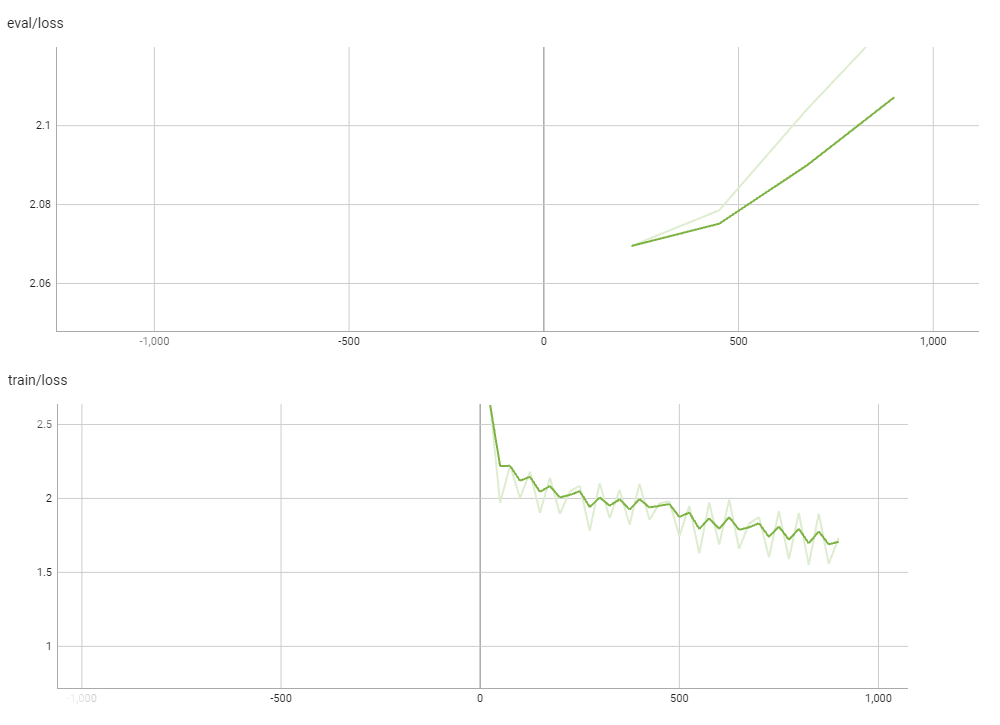

# DistilBERT Fine-Tuning

### Architecture

### Dataset

IMDB 50k movie review. Train set is 70%, validation set is 10% and Test set is 20% of entire dataset split

### Training

1. Learning Rate: Graphs show a decreased learning rate, it is common in
training as it shows model is converging by doing smaller updates to the
weights as training progresses
2. Global Step: This indicates the number of batches the has been trained
on. It increase with each batch processed
3. Gradient Norm: A slight decrease in gradient norm suggests that the
updates to the model’s weights are becoming more stable as training goes
on
4. Epoch: It just means that the model is seeing the data repeatedly, and
with each pass(epoch), it’s learning more about dataset
5. Loss: The declining loss means model’s prediction are getting closer to
the actual labels, which the model is learning effectively.

#### Train loop

#### Test loop

### Results

- Final accuracy with Training loop: 93.82%
- Final accuracy with HuggingFace Trainer: 93.56%

-----

# Mistral Fine-Tuning

### Architecture

Mistral is based on Transformers Architecture.

The parameters of Mistral architecture are:

| Parameter    | Value   |
|--------------|---------|
| dim          | 4096    |
| n_layers     | 32      |
| head_dim     | 128     |
| hidden_dim   | 14336   |
| n_heads      | 32      |
| n_kv_heads   | 8       |
| window_size  | 4096    |
| context_len  | 8192    |
| vocab_size   | 32000   |

**Sliding Window Attention (SWA)** The sliding window attention pattern employs a fixed-size window attention surrounding each token. This means that each position in a layer can attend to hidden states from the previous layer within a range of 4096 tokens behind it and up to itself.

**Rolling Buffer Cache**: Fixed cache size.

**Pre-fill and Chunking**: Devide the prompt into smaller pieces and then work with those pieces instead of the all prompt. 

### Dataset

IMDB movie review, 900 cases for training, 100 cases for evaluating and 2500 cases for testing. The data is balanced.

### Training

The loss function that we have used was Cross-Entropy Loss.

LossFunction(p, q) = -$\sum_{x=1}^{N} p(x) * log(q(x))$

Where:
- p is the true probability distribution (usually a one-hot encoded vector representing the ground truth).
- q is the predicted probability distribution (the output probabilities from the model).
- x represents each class or category in the distribution.

### Results

- Final Accuracy with Supervised Fine-tuning Trainer: 96.40%
