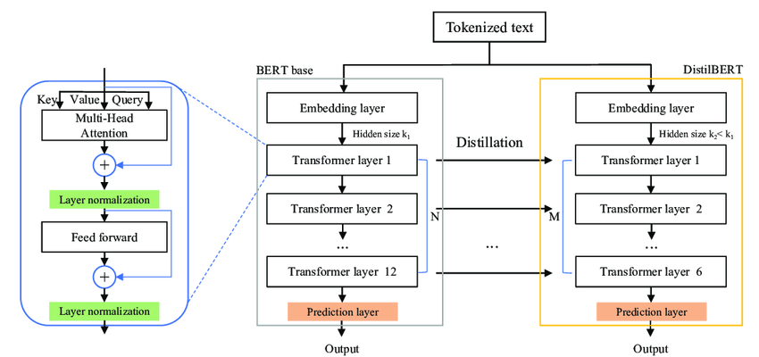

# Introduction


Nowadays high-performing natural language models gained much relevance. In this project, we used three different pre-trained LLMs in order to classify opinions as positive or negative. The LLMs utilized in our study include:

- Distilbert
- Mistral
- Gemma

Our [GitHub repository](https://github.com/AbhimanyuAryan/llm-finetuning/) contains all the code and explanations for every decision we have made.

# DistilBERT Fine-Tuning

### Introduction

Distilbert as mentioned in [paper](https://arxiv.org/abs/1910.01108) is smaller variant of Bert with 66 million parameters. It was found that it's possible to reduce size of BERT model by 40% while retraining 97% of its language understanding capabilities and being 60% faster.

### Architecture




DistilBERT really a stripped down version of BERT. Instead of 12 transformer layers it contains 6 transformer layers. The overall structure:

- Embedding Layer: Token Embeddings, Position Embeddings
- Transformer Layers: Each transformer layer contains
    - Multi-Head self-attention
    - Feed-Forward Neural Network
    - Layer Normalization
    - Residual Connections

### Fine Tuning

**Dataset**: IMDB 50k movie review. Train set is 70%, validation set is 10% and Test set is 20% of entire dataset split.

#### Fine Tuning Scikit Version


The input text is tokenized into `input_ids` and `attention_mask` and passed through the DistilBERT model to get the `last_hidden_states`


**Feature Extraction**

```python
with torch.no_grad():
    last_hidden_states = model(input_ids, attention_mask=attention_mask)

features = last_hidden_states[0][:,0,:].numpy()
```

```
Tokenized input:
[
    [CLS] I love this movie [SEP],
    [CLS] This film was terrible [SEP]
]

last_hidden_states:
[
    [h_CLS_1, h_I, h_love, h_this, h_movie, h_SEP_1],
    [h_CLS_2, h_This, h_film, h_was, h_terrible, h_SEP_2]
]


Selected `[CLS]` token hidden states:
[
    h_CLS_1,  # Contains contextual information from "I love this movie."
    h_CLS_2   # Contains contextual information from "This film was terrible."
]
```

Self-attention layers ensure that h_CLS_1 and h_CLS_2 (the hidden states for the [CLS] token) contain information from all other tokens in their respective sentences.


**Training Loop**

### Custom Training Loop Parameters

| Parameter / Step                            | Value / Description                                                           |
|---------------------------------------------|-------------------------------------------------------------------------------|
| `model`                                     | `DistilBertForSequenceClassification` from 'distilbert-base-uncased'          |
| `optimizer`                                 | `AdamW` with learning rate `5e-5` and weight decay `0.01`                     |
| `scheduler`                                 | Linear schedule with warmup, `500` warmup steps                               |
| `num_training_steps`                        | `len(train_loader) * NUM_EPOCHS`                                              |
| `num_warmup_steps`                          | `500`                                                                         |
| `batch_size`                                | Defined by `train_loader` and `valid_loader`                                  |
| `num_epochs`                                | `NUM_EPOCHS`                                                                  |
| `device`                                    | `DEVICE` (e.g., 'cuda' or 'cpu')                                              |
| `compute_accuracy` function                 | Computes accuracy of the model                                                |
| `input_ids`, `attention_mask`, `labels`     | Inputs to the model for each batch                                            |
| `outputs`                                   | Model outputs containing `loss` and `logits`                                  |
| `loss.backward()`                           | Computes gradients                                                            |
| `optim.step()`                              | Updates model parameters                                                      |
| `scheduler.step()`                          | Updates learning rate schedule                                                |
| `model.eval()`                              | Switches model to evaluation mode                                             |
| `torch.no_grad()`                           | Disables gradient calculation for evaluation                                  |
| `torch.set_grad_enabled(False)`             | Disables gradient calculation for evaluation within a context manager         |
| `start_time` and `time.time()`              | Measures elapsed time for training                                            |
| Logging                                     | Prints progress every 250 batches                                             |


**HF Trainer**

### Hugging Face Trainer Parameters

| Parameter                     | Value                           | Description                                                     |
|-------------------------------|---------------------------------|-----------------------------------------------------------------|
| `output_dir`                  | `my_awesome_model`              | Directory to save the model and checkpoints.                    |
| `learning_rate`               | `2e-5`                          | Learning rate for the training.                                 |
| `per_device_train_batch_size` | `16`                            | Batch size per device during training.                          |
| `per_device_eval_batch_size`  | `16`                            | Batch size per device during evaluation.                        |
| `num_train_epochs`            | `2`                             | Number of training epochs.                                      |
| `weight_decay`                | `0.01`                          | Weight decay to apply (if any).                                 |
| `evaluation_strategy`         | `epoch`                         | Evaluation strategy to use.                                     |
| `save_strategy`               | `epoch`                         | Save strategy to use.                                           |
| `load_best_model_at_end`      | `True`                          | Whether to load the best model at the end of training.          |
| `push_to_hub`                 | `True`                          | Whether to push the model to the Hugging Face Hub.              |


## Training: Summarize important aspects of the code.

1. Learning Rate: Graphs show a decreased learning rate, it is common in
training as it shows model is converging by doing smaller updates to the
weights as training progresses
2. Global Step: This indicates the number of batches the has been trained
on. It increase with each batch processed
3. Gradient Norm: A slight decrease in gradient norm suggests that the
updates to the model’s weights are becoming more stable as training goes
on
4. Epoch: It just means that the model is seeing the data repeatedly, and
with each pass(epoch), it’s learning more about dataset
5. Loss: The declining loss means model’s prediction are getting closer to
the actual labels, which the model is learning effectively.

**Train loop**:

<div align="center">


</div>

**Test loop**:

<div align="center">


</div>

### Results

<div align="center">

|       Method            | Accuracy |
|:-----------------------:|:--------:|
| Training loop           | 93.82%   |
| HuggingFace Trainer     | 93.56%   |

</div>

# Mistral Fine-Tuning

### Introduction

Mistral is an [open-source model](https://github.com/mistralai/mistral-src) owned by the company [Mistral AI](https://mistral.ai/). It was published with the a [paper](https://arxiv.org/abs/2310.06825) and it is famous due to its performance and efficiency. Compared to the Llama model, Mistral surpasses the first version of Llama in all evaluated benchmarks. With the second version of Llama, Mistral is better in mathematics and code generation. 

We build a notebook based on a [public notebook](https://www.kaggle.com/code/lucamassaron/fine-tune-mistral-v0-2-for-sentiment-analysis). In relation with Mistral version, we used the version [Mistral-7B-Instruct-v0.2](https://huggingface.co/mistralai/Mistral-7B-Instruct-v0.2).

### Architecture

Mistral is based on Transformers Architecture.

The parameters of Mistral architecture are:

<div align="center">

| Parameter    | Value  | Explanation |
|:------------:|:------:|-------------|
| dim          | 4096   | Dimensionality of the model's embeddings and hidden states. This defines the size of the vectors used throughout the model.                                                    |
| n_layers     | 32     | Number of transformer blocks in the model. |
| head_dim     | 128    | Dimensionality of each attention head. |
| hidden_dim   | 14336  | Dimensionality of the feed-forward layer within each transformer block. |
| n_heads      | 32     | Number of attention heads in the multi-head attention mechanism.|
| n_kv_heads   | 8      | Number of key-value heads used in attention. |
| window_size  | 4096   | Size of the local context window used in models with attention mechanisms that restrict the range of attention to a local context. |
| context_len  | 8192   | Maximum length of the input sequences. |
| vocab_size   | 32000  | How many unique tokens (words, subwords, or characters) the model can represent. |


</div>

**Sliding Window Attention (SWA)** The sliding window attention pattern employs a fixed-size window attention surrounding each token. This means that each position in a layer can attend to hidden states from the previous layer within a range of 4096 tokens behind it and up to itself.
<div align="center">
    


</div>

**Rolling Buffer Cache**: Fixed cache size.
<div align="center">
    


</div>

**Pre-fill and Chunking**: Devide the prompt into smaller pieces and then work with those pieces instead of the all prompt. 
<div align="center">
    


</div>


### Fine Tuning

**Dataset**: IMDB movie review, 300 cases for training, 100 cases for evaluating and 2500 cases for testing. The data is balanced.

**Training** For tune Mistral we have used the library Supervised Fine-tuning Trainer, as known as [SFTT](https://huggingface.co/docs/trl/sft_trainer) instead of the normal [Trainer](https://huggingface.co/docs/transformers/main_classes/trainer).

- More appropriated to text classification problems.
- Our dataset is not that large.
- The training process is faster.
- Uses less memory.

<div align="center">


| Epoch | Training Loss | Validation Loss |
|:-----:|:-------------:|:---------------:|
|   1   |    2.019900   |    2.116099     |
|   2   |    1.980300   |    2.124171     |
|   3   |    1.883400   |    2.153847     |
|   4   |    1.827500   |    2.167378     |

</div>

<div align="center">
    


</div>

### Results

<div align="center">
    
| Stage    | Metric                        | Value |
|:--------:|:-----------------------------:|:-----:|
| Original | Accuracy                      | 63.0% |
| Original | Accuracy for negative reviews | 98.0% |
| Original | Accuracy for positive reviews | 28.0% |
| Tuned    | Accuracy                      | 96.0% |
| Tuned    | Accuracy for negative reviews | 97.4% |
| Tuned    | Accuracy for positive reviews | 94.6% |


</div>

# Gemma Zero-Shot Learning

The Gemma directory contains four Jupyter notebooks used to explore the Gemma model's text classification capabilities.

Initially, we aimed to fine-tune this model, just like we did with *Mistral* and *Distilbert*. Sadly, that was not feasible because every attempt ended up consuming all available resources in both Kaggle and Google Colab.

So, we focused on implementing Zero-Shot Learning to test the model's performance in this task. We successfully managed to implement this type of classification. After doing so, we attempted to implement both One-Shot classification and Few-Shot classification.

These attempts led to failure, as once again, we consumed all the resources.

However, we still want to provide the code for all our attempts. We will not go into as much detail as we did for the other two models, since we can consider this to be an extra that improves the overall work.


## Model Architecture

The Gemma model is based on Transformers Architecture. It comes in two varients with either 2B or 7B parameters and they has the following values:

| Parameter             | 2B   | 7B   |
|-----------------------|------|------|
| d_model               | 2048 | 3072 |
| Layers      | 18   | 28   |
| Feedforward hidden dims | 32768 | 49152 |
| Num Heads       | 8    | 16   |
| Num of KV heads    | 1    | 16   |
| Head size             | 256  | 256  |
| Vocab size       | 256128 | 256128 |


These models also have a fair few enhancements such as:

- **Multi-Query Attention**: The 7B model utilizes multi-head attention, whereas the 2B model employs multi-query attention with `num_kv_heads = 1`. Ablation studies indicate that multi-query attention performs effectively at smaller scales.
- **RoPE Embeddings**: Instead of absolute positional embeddings, rotary positional embeddings are employed in each layer. Moreover, embeddings are shared across inputs and outputs to minimize model size.
- **GeGLU Activations**: Conventional ReLU activation function is replaced with the GeGLU activation function, providing improved performance.
- **RMSNorm**: Stabilize trainings, RMSNorm is applied to the input of each transformer sub-layer, including both the attention and feedforward layers.

The parameters can be split into embedding and non-embedding in the following manner:

| Model | Embedding Parameters | Non-embedding Parameters |
|-------|-----------------------|--------------------------|
| 2B    | 524,550,144           | 1,981,884,416            |
| 7B    | 786,825,216           | 7,751,248,896            |

These models inherit a large vocabulary from the Gemini framework, comprising 256,000 entries handling multiple languages, which results in larger embedding parameter counts compared to models limited to fewer languages.

### Code Explanation

We kept some code blocks that are not particularly relevant, such as some pip installs that ended up not being utilized in the final version. Yet, these would be necessary for the failed fine-tuning. We also kept under comments a function that can be used to clear resources on Google Colab.

Three of our notebooks implement Zero-Shot Learning. These notebooks contain the exact same content, but we created them to prove the randomness in zero-shot learning as results vary on each execution. Then we have a notebook that contains the same basic code with the code needed for One Shot and Few Shot classification added to it. We kept the output that showcases the error.

To sum up what we did, we basically load the dataset and utilizing the pipeline abstraction from transformers library we can simply run the model for zero shot classification for two labels. This generates two values one for each label, we then just pick the label with the highest value and compare to the reference values.

### Results

These are some of the results we obtained after running our notebooks. The first three executions can be consulted on the notebooks present in the repository, the last two come from other executions we did not include in the repository.

<div align="center">

| Execution | Accuracy | Recall | Precision |
|:---------:|:--------:|:------:|:---------:|
|    #1     |   0.49   |  0.49  |    0.48   |
|    #2     |   0.62   |  0.62  |    0.62   |
|    #3     |   0.60   |  0.60  |    0.71   |
|    #4     |   0.44   |  0.44  |    0.44   |
|    #5     |   0.64   |  0.64  |    0.70   |
|  Average  | 0.56     |  0.56  |    0.59   |

</div>

# Conclusions

Unsurprisingly, Mistral was the best in terms of performance. This outcome was anticipated, given Mistral's superior pre-training compared to Distilbert, and the absence of specific tuning for Gemma.

Our journey has been truly fulfilling, marked by the exploration of diverse models and methodologies, each offering unique insights into the realm of natural language processing.

---

# References

1. [Mistral 7B, Albert Q. Jiang, Alexandre Sablayrolles, Arthur Mensch, Chris Bamford, Devendra Singh Chaplot, Diego de las Casas, Florian Bressand, Gianna Lengyel, Guillaume Lample, Lucile Saulnier, Lélio Renard Lavaud, Marie-Anne Lachaux, Pierre Stock, Teven Le Scao, Thibaut Lavril, Thomas Wang, Timothée Lacroix, William El Sayed, 2023. arXiv eprint: 2310.06825, primary class: cs.CL.](https://arxiv.org/abs/2310.06825)

2. [Gemma Team, Thomas Mesnard, Cassidy Hardin, Robert Dadashi, Surya Bhupatiraju, Shreya Pathak, Laurent Sifre, Morgane Rivière, Mihir Sanjay Kale, Juliette Love, Pouya Tafti, Léonard Hussenot, Pier Giuseppe Sessa, Aakanksha Chowdhery, Adam Roberts, Aditya Barua, Alex Botev, Alex Castro-Ros, Ambrose Slone, Amélie Héliou, Andrea Tacchetti, Anna Bulanova, Antonia Paterson, Beth Tsai, Bobak Shahriari, Charline Le Lan, Christopher A. Choquette-Choo, Clément Crepy, Daniel Cer, Daphne Ippolito, David Reid, Elena Buchatskaya, Eric Ni, Eric Noland, Geng Yan, George Tucker, George-Christian Muraru, Grigory Rozhdestvenskiy, Henryk Michalewski, Ian Tenney, Ivan Grishchenko, Jacob Austin, James Keeling, Jane Labanowski, Jean-Baptiste Lespiau, Jeff Stanway, Jenny Brennan, Jeremy Chen, Johan Ferret, Justin Chiu, Justin Mao-Jones, Katherine Lee, Kathy Yu, Katie Millican, Lars Lowe Sjoesund, Lisa Lee, Lucas Dixon, Machel Reid, Maciej Mikuła, Mateo Wirth, Michael Sharman, Nikolai Chinaev, Nithum Thain, Olivier Bachem, Oscar Chang, Oscar Wahltinez, Paige Bailey, Paul Michel, Petko Yotov, Rahma Chaabouni, Ramona Comanescu, Reena Jana, Rohan Anil, Ross McIlroy, Ruibo Liu, Ryan Mullins, Samuel L. Smith, Sebastian Borgeaud, Sertan Girgin, Sholto Douglas, Shree Pandya, Siamak Shakeri, Soham De, Ted Klimenko, Tom Hennigan, Vlad Feinberg, Wojciech Stokowiec, Yu-hui Chen, Zafarali Ahmed, Zhitao Gong, Tris Warkentin, Ludovic Peran, Minh Giang, Clément Farabet, Oriol Vinyals, Jeff Dean, Koray Kavukcuoglu, Demis Hassabis, Zoubin Ghahramani, Douglas Eck, Joelle Barral, Fernando Pereira, Eli Collins, Armand Joulin, Noah Fiedel, Evan Senter, Alek Andreev, Kathleen Kenealy. (2024). Gemma: Open Models Based on Gemini Research and Technology. arXiv preprint arXiv:2403.08295.](https://arxiv.org/abs/2403.08295)

3. [Victor Sanh, Lysandre Debut, Julien Chaumond, and Thomas Wolf. "DistilBERT, a distilled version of BERT: smaller, faster, cheaper and lighter." arXiv preprint arXiv:1910.01108, 2020.](https://arxiv.org/abs/1910.01108)
